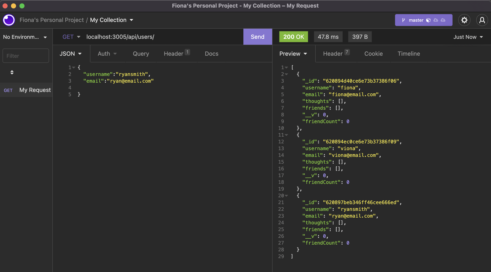
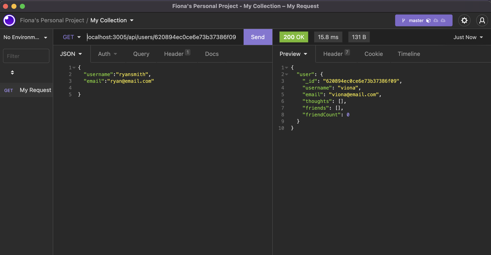
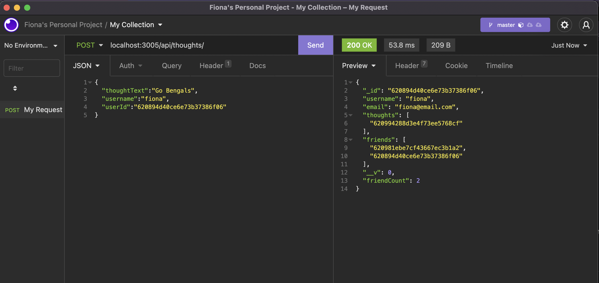

# social_network_api
Week 18 NoSQL / Mongo


## Description 
This is a back end code to show my ability to build an API for a social network web application. This api enables users to share their thoughts and reactions to friends, as well as make a friend list. 
Technology used is Express.js, MongoDB database, and Javascript. 

## Intsallation
To start the application, do the following. In your terminal type in 
```
npm i
npm start
```
Then in insomnia or postman put localhost:3005 in your endpoint and follow the code in the route folder to send certain endpoint to display specific data.

## Walkthrough Video
Here is the link to the walkthrough video: 

## License
This project is licensed under the [MIT License](https://opensource.org/licenses/MIT).

## Preview 



## Heroku
The live delpoyment is here:  https://boiling-plains-68999.herokuapp.com/
* NOTE:  this link will NOT show any front end display. Heroku is used here to connection mongodb atlas databased to our code so can use another programs such as moongo compass, insomina, or postman to show functionality of our back end code. 

## Questions
For any futher assistance, you may contact me at:
  * Github: [fiona1nicdao](<https://github.com/fiona1nicdao>)